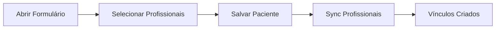
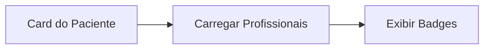

# 📋 Sistema de Relacionamento Paciente-Profissional

## 🎯 Visão Geral

Sistema de relacionamento **muitos-para-muitos** que permite que um paciente seja atendido por vários profissionais simultaneamente (ex: Fonoaudiólogo + Médico).

---

## 🗄️ Banco de Dados

### Tabela Intermediária: `pacientes_profissionais`

```sql
CREATE TABLE pacientes_profissionais (
    id UUID PRIMARY KEY,
    paciente_id UUID → pacientes.id,
    profissional_id UUID → usuarios.id,
    clinica_id UUID → clinicas.id,
    data_vinculo TIMESTAMP,
    ativo BOOLEAN,
    observacoes TEXT,
    UNIQUE(paciente_id, profissional_id)
);
```

### Índices Criados
- `idx_pacientes_profissionais_paciente`
- `idx_pacientes_profissionais_profissional`
- `idx_pacientes_profissionais_clinica`
- `idx_pacientes_profissionais_ativo`

### RLS Policies
- **SELECT**: Usuários veem vínculos da sua clínica
- **INSERT/UPDATE/DELETE**: Apenas Admin e Recepção

---

## 🔌 Backend (Flask)

### Endpoints Criados

#### `GET /pacientes/<id>/profissionais`
Lista todos os profissionais vinculados a um paciente.

**Response:**
```json
[
  {
    "id": "uuid",
    "nome_completo": "Dr. João Silva",
    "role": "fono",
    "especialidade": "Audiologia",
    "data_vinculo": "2026-03-01T10:00:00Z"
  }
]
```

#### `POST /pacientes/<id>/profissionais`
Vincula um ou mais profissionais ao paciente.

**Request Body:**
```json
{
  "profissional_ids": ["uuid1", "uuid2"]
}
```

#### `DELETE /pacientes/<id>/profissionais/<profissional_id>`
Remove vínculo entre paciente e profissional (soft delete).

#### `PUT /pacientes/<id>/profissionais/sync`
Sincroniza lista completa de profissionais (adiciona novos, remove não selecionados).

**Request Body:**
```json
{
  "profissional_ids": ["uuid1", "uuid2", "uuid3"]
}
```

**Response:**
```json
{
  "adicionados": 2,
  "mantidos": 1,
  "removidos": 1
}
```

---

## ⚛️ Frontend (Next.js)

### Services

#### `usuarioService.getProfissionais()`
Retorna lista de todos os profissionais (fono + medico) da clínica.

#### `pacienteService.getProfissionais(pacienteId)`
Retorna profissionais vinculados ao paciente.

#### `pacienteService.syncProfissionais(pacienteId, profissionalIds)`
Sincroniza profissionais no save do formulário.

### Componentes Atualizados

#### `PacienteForm.jsx`
- ✅ **Multi-select com checkboxes** para selecionar profissionais
- ✅ **Tags visuais** mostrando profissionais selecionados
- ✅ **Sincronização automática** ao salvar (cria vínculos novos, remove desmarcados)
- ✅ **Carrega vínculos existentes** ao editar paciente

**UI:**
```
┌─────────────────────────────────────────┐
│ Profissionais Responsáveis              │
├─────────────────────────────────────────┤
│ ☑ Dr. João Silva - Fonoaudiólogo        │
│ ☑ Dra. Maria Santos - Médico            │
│ ☐ Dr. Pedro Costa - Fonoaudiólogo       │
└─────────────────────────────────────────┘

Selected: [Dr. João Silva ×] [Dra. Maria Santos ×]
```

#### `PacienteCard.jsx`
- ✅ **Exibe todos os profissionais** vinculados ao paciente
- ✅ **Ícone Users** para identificar seção
- ✅ **Badges coloridos** com nomes dos profissionais

**UI:**
```
┌─────────────────────────────────────────┐
│ 👤 José da Silva                        │
│ CPF: 123.456.789-00                     │
├─────────────────────────────────────────┤
│ 👥 Profissionais Responsáveis:          │
│ [Dr. João] [Dra. Maria]                 │
└─────────────────────────────────────────┘
```

---

## 📊 Fluxo de Uso

### 1. Criar/Editar Paciente (Admin/Recepcao)



**Passos:**
1. Admin/Recepcao clica em **Novo Paciente** ou **Editar**
2. Preenche dados pessoais
3. **Marca checkboxes** dos profissionais responsáveis
4. Clica em **Salvar**
5. Sistema cria/atualiza paciente + sincroniza profissionais

### 2. Visualizar Paciente



**Resultado:**
- Todos os usuários (Admin, Recepcao, Fono, Médico) veem quais profissionais atendem cada paciente

---

## 🔒 Segurança & Permissões

### Quem pode vincular profissionais?
- ✅ **Admin**: Pode vincular qualquer profissional
- ✅ **Recepção**: Pode vincular qualquer profissional
- ❌ **Profissionais (fono/médico)**: Não podem alterar vínculos

### Isolamento Multi-tenant
- ✅ Todos os vínculos incluem `clinica_id`
- ✅ RLS garante que clínicas não vejam vínculos de outras
- ✅ Query filters aplicam `clinica_id` automaticamente

---

## 🧪 Como Testar

### 1. Aplicar Migration
```sql
-- Execute no Supabase SQL Editor:
c:\Users\gaabr\OneDrive\Área de Trabalho\SaaSClinico-\supabase\migrations\004_pacientes_profissionais_relacao.sql
```

### 2. Reiniciar Backend
```bash
cd backend
python app.py
```

### 3. Testar Fluxo Completo

**a) Criar Paciente com Múltiplos Profissionais:**
1. Login como Admin
2. Pacientes → Novo Paciente
3. Preencher nome: "João Teste"
4. Marcar 2+ profissionais
5. Salvar
6. Verificar: Card mostra badges dos profissionais

**b) Editar Vínculos:**
1. Editar o paciente criado
2. Desmarcar 1 profissional, marcar outro
3. Salvar
4. Verificar: Card atualiza badges

**c) Validar Backend:**
```bash
curl -X GET http://localhost:5000/pacientes/<paciente_id>/profissionais \
  -H "Authorization: Bearer <token>"
```

**Response esperado:**
```json
[
  {"id": "uuid1", "nome_completo": "Dr. João", "role": "fono"},
  {"id": "uuid2", "nome_completo": "Dra. Maria", "role": "medico"}
]
```

---

## 🚀 Casos de Uso

### 1. Tratamento Multidisciplinar
Paciente com problema de fala pode precisar de:
- Fonoaudiólogo (terapia)
- Médico Otorrinolaringologista (diagnóstico)

### 2. Substituição de Profissional
Se Dr. João sai de férias, Dra. Maria assume seus pacientes:
- Admin marca Dra. Maria nos pacientes do Dr. João
- Ambos aparecem como responsáveis

### 3. Filtros e Relatórios (Futuro)
- "Quantos pacientes o Dr. João atende?"
- "Pacientes compartilhados entre fono e médico"
- "Profissional com mais pacientes ativos"

---

## 📈 Próximas Melhorias

- [ ] **Filtro na lista de pacientes** por profissional
- [ ] **Data de início/fim** do vínculo (período de tratamento)
- [ ] **Tipo de vínculo** (responsável principal, apoio, consultor)
- [ ] **Notificações** quando paciente é atribuído
- [ ] **Página de perfil do profissional** mostrando seus pacientes
- [ ] **Estatísticas** de distribuição de pacientes

---

## ❓ FAQ

**Q: O que acontece se não selecionar nenhum profissional?**  
A: Paciente é criado sem vínculos. Pode ser vinculado depois.

**Q: Posso remover todos os profissionais de um paciente?**  
A: Sim, o sistema permite pacientes sem profissionais vinculados.

**Q: Profissionais podem ver apenas seus pacientes?**  
A: Atualmente, profissionais veem todos os pacientes da clínica (para facilitar atendimentos). Porém, é possível implementar filtro opcional.

**Q: O vínculo é permanente?**  
A: Soft delete. O registro permanece no banco com `ativo = false` para histórico.

**Q: Como migrar dados antigos?**  
A: A migration 004 migra automaticamente se existir `profissional_responsavel_id` na tabela pacientes.

---

## 🐛 Troubleshooting

### Erro: "profissional_ids é obrigatório"
**Causa:** Chamada POST sem body ou com array vazio  
**Solução:** Passar `{ "profissional_ids": ["uuid1", "uuid2"] }`

### Checkboxes não marcam ao editar
**Causa:** IDs dos profissionais não carregaram  
**Solução:** Verificar console: `loadPacienteProfissionais()` executou?

### Badges não aparecem no Card
**Causa:** API retornou vazio ou erro  
**Solução:** Verificar Network tab (F12) → `/pacientes/<id>/profissionais`

---

## 📝 Exemplo Completo

```javascript
// Criar paciente com 2 profissionais
const paciente = await pacienteService.create({
  nome_completo: "João Silva",
  cpf: "12345678900"
});

await pacienteService.syncProfissionais(paciente.id, [
  "prof-uuid-1", // Dr. João (fono)
  "prof-uuid-2"  // Dra. Maria (médico)
]);

// Buscar profissionais do paciente
const profissionais = await pacienteService.getProfissionais(paciente.id);
console.log(profissionais);
// [{ nome_completo: "Dr. João", role: "fono" }, ...]

// Remover um profissional
await pacienteService.removeProfissional(paciente.id, "prof-uuid-1");

// Adicionar novo
await pacienteService.addProfissionais(paciente.id, ["prof-uuid-3"]);
```

---

**Status:** ✅ Implementado e funcional

**Data:** 01/03/2026  
**Versão:** 1.0.0
